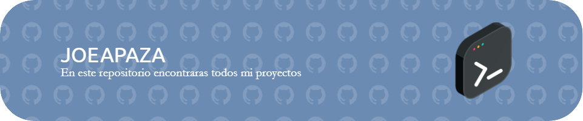

#  Bienvenido al GitHub de Joe Apaza

Es un espacio dedidacado a aprender y compartir conocimientos en programacion y tecnología.Estamos aquí para aprender juntos, resolver desafios, mejorando dia a dia y alcanzar nuestras metas.

## Tecnologias

## Estadisticas

